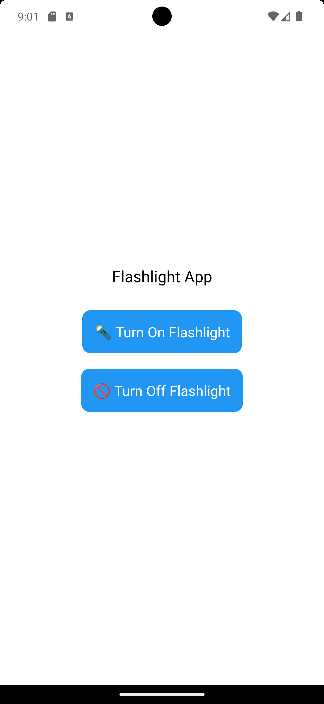

# 🔦 lab42
## Demo expo app with native android module to turn on the flashlight

<div style="width:100%;text-align:center;">
    <p align="center">
        
    </p>
</div>

----------

## ❓ Get started

#### 🏗️ Preparing

```shell
git clone https://github.com/F33RNI/lab42
cd lab42
npm install
```

#### ♻️ Run using emulator / connected phone

1. Start emulator / connect phone with USB debugging

2. Run:
```shell
npx expo run:android
```

#### 📦 Build APK

1. Remove `"projectId":` from `app.json`

2. Build locally:
```shell
eas build -p android --local
```

3. Build using [expo](https://expo.dev/):
```shell
eas build -p android
```